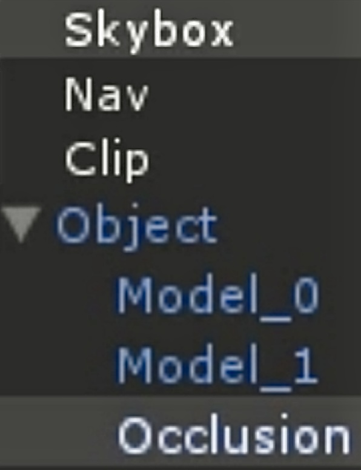

---
layout:
  title:
    visible: true
  description:
    visible: false
  tableOfContents:
    visible: true
  outline:
    visible: true
  pagination:
    visible: true
---

# Making a (very simple) Asset

### Preface

This page will teach you how to make a basic object(building) and get it ready to export for Unturned. It will **not** teach you basics about asset making, only the barebones of what is needed for you to complete and put the asset ingame.

### What makes up an Object?

_If you are too lazy to read or simply don't understand you can find videos on youtube._ [_Nelson's video_](https://youtu.be/rAZ9KEGjSUk?feature=shared) _will teach you how to make the assets but it is lengthy so you can find a short one and use_ [_Nelson's video_](https://youtu.be/rAZ9KEGjSUk?feature=shared) _for the missing details._

* Nav - is the mesh that zombies uses as its navigation mesh. This mesh does not need roofs, frames(of windows, doors, etc). The mesh should be simple and the foundation should be expanded to be more of a ramp. Every ledge should be smoothed so that it does not have such a harsh corner like the ledge of a window should be more ramp like. Needs a Mesh Collider. Tag and layer: Navmesh.
* Clip(optional) - is the mesh that the server uses as the collision, the client does not use this mesh for the collision. Needs a Collider. Tag and layer: (Large, Medium, Small)
* Skybox(optional) - is the mesh that is rendered when the object is consider as a Landmark. This mesh should be very simple at around 30 triangles. It usually does not include an interior and is a primitive shape. Needs a Mesh Filter, and Mesh Renderer. Tag and layer: (Large, Medium, Small)
* Object - is the main model which contains the LODs. The name of the LODs should be "Model\_#" with # being the number(starts from zero). Optionally, you can add an Occlusion Area. The objects in that box will have a Lod Bias applied to it making it have lower details. Needs a LOD group, Mesh Filter, Mesh Renderer, and a Mesh Collider(or a primitive collider). The Mesh Collider is usually the LOD 1(second LOD). Tag and layer: (Large, Medium, Small)
* Slots(optional) - consists of Box Colliders. The possible names are Door, Gate, Slot(for barricades like windows). See measurements(replace with link to page here?) here. Tag and layer: Logic

#### Example

<figure><figcaption><p>Example model</p></figcaption></figure>

### .Dat files

#### **Example**


```
// Hypens are not required, it is up to your preference.
GUID 01de685f-0009-418a-ace8-637ad3063a7f
ID 50000

Type Large
Landmark_Quality Medium
LOD Area
LOD_Bias 0.8
```


* **GUID**(**G**lobal **U**nique **ID**entifier) - a random unique id, you can use online generators to generate it.
* Type - Small, Medium, Large, Decal, NPC. We are making a building which is Large.
* ID - a unique id ranging from 0 - 65535(I'll use 50000)
* Landmark\_Quality - Off, Low, Medium, High, Ultra. As this is a building we will use Medium.
* LOD - Area, Mesh. Mesh uses the bounding box of the mesh as the area there are other properties to modify it but it is all numbers and practically impossible to visualize. Area uses the Occlusion Areas named "Occlusion" as the areas to apply the bias on.
* LOD\_Bias - How much to reduce the lod by. The higher the more detailed vice versa.


```
Name My First Building!
```


### Next!

Now you should have English.dat and MyFirstBuilding.dat. For now, store them somewhere where you can easily access. For the next guide, I will show you how to bundle your assets and use these dat files to finally get your assets in game!

***

(Proofread: 2024/04/24)\
Sources: [Official Documentation: Object Assets](https://docs.smartlydressedgames.com/en/stable/assets/object-asset.html)\
Example Files: .../Objects/Large/Buildings
